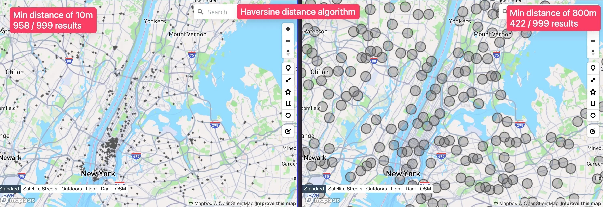

# GeoSpread

A library designed to filter a list of geographical points, ensuring that they are spread out from each other by a minimum distance in meters, optionally starting from a specific point. By applying the Haversine algorithm, GeoSpread prunes the input list to create a more evenly distributed set of points, suitable for various geospatial applications.



## Installation

You can install PolyUnion via npm:

```shell
npm install geospread
```

## Usage

```js
import geospread from 'geospread';

// Example GeoJSON FeatureCollection input
const points = [
  [-73.9956, 40.7481],
  [-73.9930, 40.7479],
  [-73.9939, 40.7466],
  [-73.9915, 40.7454],
  [-73.9909, 40.7461]
];

const minDistance = 130;
const startPoint = [-73.9939, 40.7466];
const result = geospread(points, minDistance, startPoint);

console.log(result);
// [[ -73.9939, 40.7466 ], [ -73.9956, 40.7481 ], [ -73.9915, 40.7454 ]]
```

The function has 2 parameters:

- `points` - an array of points in the format `[longitude, latitude]`. Note the order is longitude first, latitude second.
- `minDistance` - the minimum distance in meters between each point
- `startPoint` - an optional starting point in the format `[longitude, latitude]`. Note the order is longitude first, latitude second.
